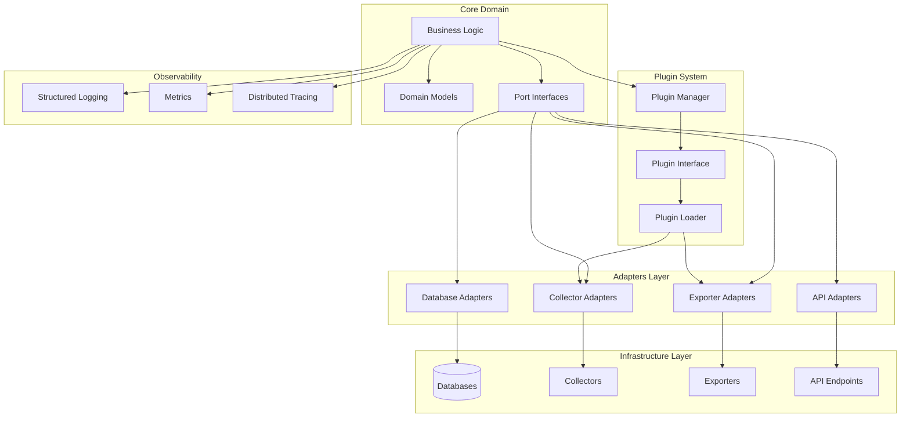

# Design Document: CloudScope Modular Architecture

## Overview

This design document outlines the architectural approach for decoupling CloudScope from its dependencies and creating a more modular, maintainable system. The design follows lean stack principles and Test-Driven Development (TDD) methodology to ensure high quality, maintainable code with minimal waste.

The architecture will progressively evolve through three phases:
1. Rules-based foundation with simple file-based storage
2. Enhanced heuristics with smart caching and adaptive rules
3. Advanced features with AI/LLM integration and graceful fallbacks

## Architecture

### Core Architectural Principles

1. **Hexagonal Architecture (Ports and Adapters)**: Separate core business logic from external dependencies
2. **Dependency Inversion**: High-level modules do not depend on low-level modules
3. **Interface Segregation**: Many client-specific interfaces are better than one general-purpose interface
4. **Progressive Enhancement**: Start with simple implementations and enhance incrementally
5. **Testability First**: Design for testability from the beginning

### High-Level Architecture Diagram



## Components and Interfaces

### 1. Core Domain Layer

The Core Domain Layer contains the business logic and domain models of CloudScope, independent of any external dependencies.

#### Domain Models

```python
# Example domain model
class Asset:
    def __init__(self, id: str, name: str, asset_type: str, source: str):
        self.id = id
        self.name = name
        self.asset_type = asset_type
        self.source = source
        self.metadata = {}
        self.tags = {}
        self.risk_score = 0
        self.created_at = datetime.now()
        self.updated_at = datetime.now()
    
    def add_metadata(self, key: str, value: Any) -> None:
        self.metadata[key] = value
        self.updated_at = datetime.now()
    
    def add_tag(self, key: str, value: str) -> None:
        self.tags[key] = value
        self.updated_at = datetime.now()
    
    def set_risk_score(self, score: int) -> None:
        if 0 <= score <= 100:
            self.risk_score = score
            self.updated_at = datetime.now()
        else:
            raise ValueError("Risk score must be between 0 and 100")
```

#### Port Interfaces

```python
# Database port interface
class AssetRepository(ABC):
    @abstractmethod
    def save(self, asset: Asset) -> str:
        """Save an asset and return its ID"""
        pass
    
    @abstractmethod
    def get_by_id(self, asset_id: str) -> Optional[Asset]:
        """Get an asset by ID"""
        pass
    
    @abstractmethod
    def find(self, query: Dict[str, Any], limit: int = 100, offset: int = 0) -> List[Asset]:
        """Find assets matching query"""
        pass
    
    @abstractmethod
    def delete(self, asset_id: str) -> bool:
        """Delete an asset by ID"""
        pass
```

### 2. Adapter Layer

The Adapter Layer contains implementations of the port interfaces that connect to external dependencies.

#### Database Adapters

```python
# File-based database adapter (Phase 1)
class FileBasedAssetRepository(AssetRepository):
    def __init__(self, base_path: str):
        self.base_path = base_path
        os.makedirs(base_path, exist_ok=True)
    
    def save(self, asset: Asset) -> str:
        file_path = os.path.join(self.base_path, f"{asset.id}.json")
        with open(file_path, 'w') as f:
            json.dump(asset.__dict__, f)
        return asset.id
    
    def get_by_id(self, asset_id: str) -> Optional[Asset]:
        file_path = os.path.join(self.base_path, f"{asset_id}.json")
        if not os.path.exists(file_path):
            return None
        
        with open(file_path, 'r') as f:
            data = json.load(f)
            asset = Asset(data['id'], data['name'], data['asset_type'], data['source'])
            asset.__dict__.update(data)
            return asset
    
    # Other methods implementation...

# Memgraph adapter (can be added later)
class MemgraphAssetRepository(AssetRepository):
    def __init__(self, connection_string: str):
        self.connection = self._connect(connection_string)
    
    def _connect(self, connection_string: str):
        # Connection logic
        pass
    
    # Implementation of interface methods...

# SQLite adapter (simple relational DB option)
class SQLiteAssetRepository(AssetRepository):
    def __init__(self, db_path: str):
        self.connection = sqlite3.connect(db_path)
        self._create_tables_if_not_exist()
    
    def _create_tables_if_not_exist(self):
        # Table creation logic
        pass
    
    # Implementation of interface methods...
```

#### Collector Adapters

```python
# Collector interface
class Collector(ABC):
    @abstractmethod
    def collect(self) -> List[Asset]:
        """Collect assets from the source"""
        pass
    
    @abstractmethod
    def get_source_name(self) -> str:
        """Get the name of the source"""
        pass

# Simple file collector
class FileCollector(Collector):
    def __init__(self, file_path: str):
        self.file_path = file_path
    
    def collect(self) -> List[Asset]:
        assets = []
        with open(self.file_path, 'r') as f:
            reader = csv.DictReader(f)
            for row in reader:
                asset = Asset(
                    id=row.get('id', str(uuid.uuid4())),
                    name=row.get('name', ''),
                    asset_type=row.get('asset_type', 'unknown'),
                    source=self.get_source_name()
                )
                # Add metadata from remaining columns
                for key, value in row.items():
                    if key not in ['id', 'name', 'asset_type']:
                        asset.add_metadata(key, value)
                assets.append(asset)
        return assets
    
    def get_source_name(self) -> str:
        return f"file:{os.path.basename(self.file_path)}"
```

### 3. Plugin System

The Plugin System allows for dynamic loading and management of collectors and exporters.

```python
# Plugin interface
class Plugin(ABC):
    @abstractmethod
    def get_name(self) -> str:
        """Get the name of the plugin"""
        pass
    
    @abstractmethod
    def get_version(self) -> str:
        """Get the version of the plugin"""
        pass
    
    @abstractmethod
    def get_description(self) -> str:
        """Get the description of the plugin"""
        pass
    
    @abstractmethod
    def get_dependencies(self) -> List[str]:
        """Get the dependencies of the plugin"""
        pass

# Collector plugin
class CollectorPlugin(Plugin):
    @abstractmethod
    def get_collector(self) -> Collector:
        """Get the collector implementation"""
        pass

# Plugin manager
class PluginManager:
    def __init__(self, plugin_dir: str):
        self.plugin_dir = plugin_dir
        self.plugins: Dict[str, Plugin] = {}
        self.load_plugins()
    
    def load_plugins(self) -> None:
        """Load all plugins from the plugin directory"""
        for file in os.listdir(self.plugin_dir):
            if file.endswith('.py') and not file.startswith('__'):
                try:
                    module_path = os.path.join(self.plugin_dir, file)
                    spec = importlib.util.spec_from_file_location(file[:-3], module_path)
                    if spec and spec.loader:
                        module = importlib.util.module_from_spec(spec)
                        spec.loader.exec_module(module)
                        
                        # Find plugin classes
                        for attr_name in dir(module):
                            attr = getattr(module, attr_name)
                            if (isinstance(attr, type) and 
                                issubclass(attr, Plugin) and 
                                attr != Plugin and 
                                attr != CollectorPlugin):
                                plugin = attr()
                                self.plugins[plugin.get_name()] = plugin
                                logger.info(f"Loaded plugin: {plugin.get_name()} v{plugin.get_version()}")
                except Exception as e:
                    logger.error(f"Failed to load plugin from {file}: {str(e)}")
    
    def get_plugin(self, name: str) -> Optional[Plugin]:
        """Get a plugin by name"""
        return self.plugins.get(name)
    
    def get_collector_plugins(self) -> List[CollectorPlugin]:
        """Get all collector plugins"""
        return [p for p in self.plugins.values() if isinstance(p, CollectorPlugin)]
```

### 4. Observability

The Observability component provides structured logging, metrics, and distributed tracing.

```python
# Structured logger
class StructuredLogger:
    def __init__(self, service_name: str):
        self.service_name = service_name
        self.logger = logging.getLogger(service_name)
        self.setup_logging()
    
    def setup_logging(self) -> None:
        """Set up JSON logging"""
        handler = logging.StreamHandler()
        formatter = jsonlogger.JsonFormatter(
            '%(timestamp)s %(level)s %(name)s %(message)s',
            rename_fields={'levelname': 'level', 'asctime': 'timestamp'}
        )
        handler.setFormatter(formatter)
        self.logger.addHandler(handler)
        self.logger.setLevel(logging.INFO)
    
    def info(self, message: str, **kwargs) -> None:
        """Log an info message with structured data"""
        self.logger.info(message, extra=self._add_context(kwargs))
    
    def error(self, message: str, **kwargs) -> None:
        """Log an error message with structured data"""
        self.logger.error(message, extra=self._add_context(kwargs))
    
    def _add_context(self, data: Dict[str, Any]) -> Dict[str, Any]:
        """Add common context to log data"""
        return {
            'service': self.service_name,
            'timestamp': datetime.utcnow().isoformat(),
            'trace_id': get_current_trace_id(),
            **data
        }

# OpenTelemetry integration
def setup_telemetry(service_name: str) -> None:
    """Set up OpenTelemetry for distributed tracing"""
    resource = Resource.create({"service.name": service_name})
    
    # Set up tracing
    tracer_provider = TracerProvider(resource=resource)
    trace.set_tracer_provider(tracer_provider)
    
    # Export to OTLP (OpenTelemetry Protocol)
    otlp_exporter = OTLPSpanExporter(endpoint="localhost:4317")
    span_processor = BatchSpanProcessor(otlp_exporter)
    tracer_provider.add_span_processor(span_processor)
    
    # Set up metrics
    meter_provider = MeterProvider(resource=resource)
    metrics.set_meter_provider(meter_provider)
    
    # Export metrics to OTLP
    otlp_metric_exporter = OTLPMetricExporter(endpoint="localhost:4317")
    reader = PeriodicExportingMetricReader(otlp_metric_exporter, export_interval_millis=60000)
    meter_provider.add_reader(reader)
```

## Data Models

### Asset Data Model

The core data model is the Asset, which represents any entity that CloudScope tracks.

```json
{
  "id": "550e8400-e29b-41d4-a716-446655440000",
  "name": "Example Asset",
  "asset_type": "server",
  "source": "aws_collector",
  "metadata": {
    "instance_id": "i-12345abcdef",
    "region": "us-west-2",
    "instance_type": "t2.micro",
    "launch_time": "2023-01-15T12:30:00Z"
  },
  "tags": {
    "environment": "production",
    "owner": "platform-team",
    "cost-center": "cc-123456"
  },
  "risk_score": 25,
  "created_at": "2023-01-15T12:30:00Z",
  "updated_at": "2023-01-15T12:30:00Z"
}
```

### Relationship Data Model

Relationships between assets are represented as edges in a graph.

```json
{
  "source_id": "550e8400-e29b-41d4-a716-446655440000",
  "target_id": "660e8400-e29b-41d4-a716-446655440001",
  "relationship_type": "INSTALLED_ON",
  "metadata": {
    "installation_date": "2023-01-15T12:30:00Z",
    "version": "1.2.3"
  },
  "confidence": 0.95,
  "created_at": "2023-01-15T12:30:00Z",
  "updated_at": "2023-01-15T12:30:00Z"
}
```

### CSV Export Format

The CSV export format is designed to be easily consumable by LLMs and compatible with MCP.

```csv
id,name,asset_type,source,risk_score,metadata.instance_id,metadata.region,tags.environment,tags.owner,related_assets
550e8400-e29b-41d4-a716-446655440000,Example Server,server,aws_collector,25,i-12345abcdef,us-west-2,production,platform-team,"[{""id"":""660e8400-e29b-41d4-a716-446655440001"",""relationship"":""HOSTS""}]"
660e8400-e29b-41d4-a716-446655440001,Example Database,database,aws_collector,40,rds-abcdef,us-west-2,production,data-team,"[{""id"":""550e8400-e29b-41d4-a716-446655440000"",""relationship"":""HOSTED_BY""}]"
```

## Error Handling

### Error Handling Strategy

1. **Fail Fast**: Validate inputs early and fail fast with clear error messages
2. **Graceful Degradation**: Continue with reduced functionality when components fail
3. **Comprehensive Logging**: Log all errors with context for troubleshooting
4. **Circuit Breaking**: Prevent cascading failures with circuit breakers

```python
# Example error handling with circuit breaker
class CircuitBreaker:
    def __init__(self, failure_threshold: int = 5, reset_timeout: int = 60):
        self.failure_threshold = failure_threshold
        self.reset_timeout = reset_timeout
        self.failure_count = 0
        self.last_failure_time = 0
        self.state = "CLOSED"  # CLOSED, OPEN, HALF_OPEN
    
    def execute(self, func: Callable, *args, **kwargs):
        """Execute a function with circuit breaker protection"""
        current_time = time.time()
        
        # Check if circuit is OPEN
        if self.state == "OPEN":
            if current_time - self.last_failure_time > self.reset_timeout:
                # Try to recover
                self.state = "HALF_OPEN"
            else:
                raise CircuitBreakerOpenError("Circuit breaker is open")
        
        try:
            result = func(*args, **kwargs)
            
            # Reset on success if in HALF_OPEN state
            if self.state == "HALF_OPEN":
                self.reset()
                
            return result
            
        except Exception as e:
            self.failure_count += 1
            self.last_failure_time = current_time
            
            # Open circuit if threshold reached
            if self.failure_count >= self.failure_threshold:
                self.state = "OPEN"
                
            raise e
    
    def reset(self):
        """Reset the circuit breaker"""
        self.failure_count = 0
        self.state = "CLOSED"
```

## Testing Strategy

### Test-Driven Development Approach

1. **Write Tests First**: Follow Red-Green-Refactor cycle
2. **Test Pyramid**: Unit tests > Integration tests > End-to-end tests
3. **Mocking**: Use dependency injection for easy mocking
4. **Property-Based Testing**: Test with a wide range of inputs
5. **Mutation Testing**: Ensure tests catch regressions

```python
# Example unit test for FileBasedAssetRepository
def test_file_based_repository_save_and_get():
    # Arrange
    repo = FileBasedAssetRepository(base_path=tempfile.mkdtemp())
    asset = Asset(
        id="test-id",
        name="Test Asset",
        asset_type="server",
        source="test"
    )
    
    # Act
    saved_id = repo.save(asset)
    retrieved_asset = repo.get_by_id(saved_id)
    
    # Assert
    assert saved_id == "test-id"
    assert retrieved_asset is not None
    assert retrieved_asset.id == asset.id
    assert retrieved_asset.name == asset.name
    assert retrieved_asset.asset_type == asset.asset_type
    assert retrieved_asset.source == asset.source
```

### Integration Testing

```python
# Example integration test for collector and repository
def test_collector_and_repository_integration():
    # Arrange
    temp_dir = tempfile.mkdtemp()
    csv_path = os.path.join(temp_dir, "assets.csv")
    
    # Create test CSV file
    with open(csv_path, 'w', newline='') as f:
        writer = csv.writer(f)
        writer.writerow(["id", "name", "asset_type", "region"])
        writer.writerow(["test-id", "Test Asset", "server", "us-west-2"])
    
    collector = FileCollector(file_path=csv_path)
    repo = FileBasedAssetRepository(base_path=temp_dir)
    
    # Act
    assets = collector.collect()
    for asset in assets:
        repo.save(asset)
    
    # Assert
    retrieved_asset = repo.get_by_id("test-id")
    assert retrieved_asset is not None
    assert retrieved_asset.name == "Test Asset"
    assert retrieved_asset.metadata.get("region") == "us-west-2"
```

## Security Considerations

### Security by Design

1. **Input Validation**: Validate all inputs with strict schemas
2. **Least Privilege**: Components only have access to what they need
3. **Secure Defaults**: All components have secure defaults
4. **Defense in Depth**: Multiple layers of security controls
5. **Fail Secure**: When in doubt, fail securely

```python
# Example input validation with Pydantic
class AssetInput(BaseModel):
    name: str = Field(..., min_length=1, max_length=255)
    asset_type: str = Field(..., regex=r'^[a-z_]+$')
    source: str = Field(..., min_length=1, max_length=100)
    metadata: Optional[Dict[str, Any]] = Field(default_factory=dict)
    tags: Optional[Dict[str, str]] = Field(default_factory=dict)
    risk_score: Optional[int] = Field(default=0, ge=0, le=100)
    
    @validator('name')
    def validate_name(cls, v):
        """Sanitize and validate asset name"""
        sanitized = re.sub(r'[<>"\';\\]', '', v)
        if not sanitized.strip():
            raise ValueError('Asset name cannot be empty after sanitization')
        return sanitized[:255]
    
    @validator('metadata')
    def validate_metadata(cls, v):
        """Validate metadata structure and content"""
        if not isinstance(v, dict):
            raise ValueError('Metadata must be a dictionary')
        
        if len(json.dumps(v)) > 10000:  # 10KB limit
            raise ValueError('Metadata size exceeds maximum allowed (10KB)')
        
        return v
```

## Deployment Considerations

### Containerized Deployment

```dockerfile
# Example Dockerfile for core service
FROM python:3.11-slim

# Create non-root user
RUN groupadd -r cloudscope && useradd -r -g cloudscope cloudscope

# Set working directory
WORKDIR /app

# Copy requirements and install dependencies
COPY requirements.txt .
RUN pip install --no-cache-dir -r requirements.txt

# Copy application code
COPY . .

# Set ownership
RUN chown -R cloudscope:cloudscope /app

# Switch to non-root user
USER cloudscope

# Run the application
CMD ["python", "-m", "cloudscope.main"]
```

### Native Deployment

For native deployment, the application will be packaged as a Python package that can be installed with pip.

```bash
# Example installation
pip install cloudscope

# Example configuration
cloudscope init --config-dir=/etc/cloudscope

# Example execution
cloudscope run --config=/etc/cloudscope/config.yaml
```

## Implementation Plan

### Phase 1: Core Abstractions and File-Based Storage

1. Implement core domain models and interfaces
2. Implement file-based repository adapter
3. Implement basic collector interface and file collector
4. Implement structured logging
5. Write comprehensive tests and documentation

### Phase 2: Plugin System and Observability

1. Implement plugin system for collectors and exporters
2. Implement observability with OpenTelemetry
3. Add metrics collection and monitoring
4. Enhance error handling with circuit breakers
5. Write tests and documentation for new components

### Phase 3: Multiple Database Adapters and Deployment Options

1. Implement SQLite adapter for simple relational storage
2. Implement optional Memgraph adapter
3. Create containerized deployment configuration
4. Create native deployment package
5. Write tests and documentation for new components

### Phase 4: Security Enhancements and Resilience

1. Implement comprehensive input validation
2. Add security scanning and vulnerability management
3. Implement versioned configurations with rollback
4. Add automated migration scripts with rollback
5. Write security-focused tests and documentation

### Phase 5: Advanced Features

1. Implement CSV export optimized for LLM analysis
2. Add MCP integration
3. Implement relationship detection algorithms
4. Add performance optimizations for large datasets
5. Write tests and documentation for advanced features

## Kiro Integration and Workflow Safeguards

To ensure that the lean stack principles and TDD methodology are consistently applied throughout the development process, we will implement custom rules and safeguards in Kiro workflows and pipelines.

### Custom Rules as Kiro Safeguards

```yaml
# .kiro/safeguards/modular-architecture-rules.yaml
name: "Modular Architecture Safeguards"
description: "Enforces lean stack principles and TDD methodology for CloudScope"
version: "1.0.0"
rules:
  - name: "test-first-development"
    description: "Ensures tests are written before implementation code"
    check:
      type: "file-pattern"
      pattern: "test_*.py"
      condition: "must-exist-before"
      target-pattern: "*.py"
      exclude: ["__init__.py", "conftest.py"]
    message: "Tests must be written before implementation code"
    severity: "error"

  - name: "hexagonal-architecture"
    description: "Ensures core domain logic doesn't depend on external adapters"
    check:
      type: "import-check"
      source-pattern: "cloudscope/domain/**/*.py"
      forbidden-imports: ["cloudscope/adapters/**"]
    message: "Core domain logic cannot depend on adapter implementations"
    severity: "error"

  - name: "documentation-required"
    description: "Ensures all code has proper documentation"
    check:
      type: "docstring-check"
      pattern: "**/*.py"
      exclude: ["tests/**"]
      min-coverage: 80
    message: "All public functions and classes must have docstrings"
    severity: "warning"

  - name: "observability-check"
    description: "Ensures proper logging is implemented"
    check:
      type: "code-pattern"
      pattern: "**/*.py"
      exclude: ["tests/**"]
      required-pattern: "logger\\.(info|error|warning|debug)\\("
    message: "All modules must use structured logging"
    severity: "warning"

  - name: "progressive-enhancement"
    description: "Ensures complex implementations have fallbacks"
    check:
      type: "custom-script"
      script: ".kiro/scripts/check_fallbacks.py"
    message: "Advanced features must have simple fallbacks"
    severity: "warning"
```

### Kiro Workflow Integration

```yaml
# .kiro/workflows/modular-architecture-workflow.yaml
name: "Modular Architecture Workflow"
description: "Workflow for implementing modular architecture features"
version: "1.0.0"
steps:
  - name: "requirements-validation"
    description: "Validate requirements against lean principles"
    action: "run-script"
    script: ".kiro/scripts/validate_requirements.py"
    
  - name: "test-creation"
    description: "Create test files for new features"
    action: "template"
    template: ".kiro/templates/test_template.py.j2"
    output: "tests/{{ feature_name }}/test_{{ module_name }}.py"
    
  - name: "implementation"
    description: "Implement feature after tests"
    action: "template"
    template: ".kiro/templates/implementation_template.py.j2"
    output: "cloudscope/{{ module_path }}/{{ module_name }}.py"
    requires: ["test-creation"]
    
  - name: "documentation"
    description: "Generate documentation from code"
    action: "run-script"
    script: ".kiro/scripts/generate_docs.py"
    requires: ["implementation"]
    
  - name: "validation"
    description: "Run safeguards and tests"
    action: "run-command"
    command: "pytest tests/{{ feature_name }} -v && kiro safeguard check"
    requires: ["implementation", "documentation"]
```

### CI/CD Pipeline Integration

```yaml
# .github/workflows/modular-architecture-ci.yml
name: Modular Architecture CI

on:
  push:
    branches: [ main ]
    paths:
      - 'cloudscope/**'
      - 'tests/**'
  pull_request:
    branches: [ main ]

jobs:
  safeguard-check:
    runs-on: ubuntu-latest
    steps:
      - uses: actions/checkout@v3
      - name: Set up Python
        uses: actions/setup-python@v4
        with:
          python-version: '3.11'
      - name: Install dependencies
        run: |
          python -m pip install --upgrade pip
          pip install kiro-cli
      - name: Run Kiro safeguards
        run: kiro safeguard check

  test:
    runs-on: ubuntu-latest
    needs: safeguard-check
    steps:
      - uses: actions/checkout@v3
      - name: Set up Python
        uses: actions/setup-python@v4
        with:
          python-version: '3.11'
      - name: Install dependencies
        run: |
          python -m pip install --upgrade pip
          pip install -r requirements-dev.txt
      - name: Test with pytest
        run: |
          pytest --cov=cloudscope tests/
      - name: Upload coverage report
        uses: codecov/codecov-action@v3

  build:
    runs-on: ubuntu-latest
    needs: test
    steps:
      - uses: actions/checkout@v3
      - name: Set up Python
        uses: actions/setup-python@v4
        with:
          python-version: '3.11'
      - name: Install dependencies
        run: |
          python -m pip install --upgrade pip
          pip install build
      - name: Build package
        run: python -m build
      - name: Store build artifacts
        uses: actions/upload-artifact@v3
        with:
          name: dist
          path: dist/
```

### Example Safeguard Script

```python
# .kiro/scripts/check_fallbacks.py
#!/usr/bin/env python3
"""
Check that advanced features have simple fallbacks.
"""
import ast
import sys
from pathlib import Path

def has_fallback(node):
    """Check if a function or method has fallback logic."""
    # Look for try/except blocks with specific fallback patterns
    for child in ast.walk(node):
        if isinstance(child, ast.Try):
            for handler in child.handlers:
                for stmt in handler.body:
                    # Look for comments indicating fallback
                    if (isinstance(stmt, ast.Expr) and 
                        isinstance(stmt.value, ast.Constant) and 
                        isinstance(stmt.value.value, str) and
                        "fallback" in stmt.value.value.lower()):
                        return True
                    
                    # Look for function calls with "fallback" in the name
                    if (isinstance(stmt, ast.Expr) and 
                        isinstance(stmt.value, ast.Call) and
                        hasattr(stmt.value.func, 'id') and
                        "fallback" in stmt.value.func.id.lower()):
                        return True
    
    return False

def check_file(file_path):
    """Check a Python file for fallbacks in advanced features."""
    with open(file_path, 'r') as f:
        content = f.read()
    
    tree = ast.parse(content)
    
    # Look for functions or methods with "advanced" in the name or docstring
    advanced_features = []
    for node in ast.walk(tree):
        if isinstance(node, (ast.FunctionDef, ast.AsyncFunctionDef, ast.ClassDef)):
            is_advanced = False
            
            # Check name
            if "advanced" in node.name.lower():
                is_advanced = True
            
            # Check docstring
            if (node.body and isinstance(node.body[0], ast.Expr) and 
                isinstance(node.body[0].value, ast.Constant) and
                isinstance(node.body[0].value.value, str) and
                "advanced" in node.body[0].value.value.lower()):
                is_advanced = True
            
            if is_advanced:
                if not has_fallback(node):
                    print(f"WARNING: Advanced feature '{node.name}' in {file_path} has no fallback")
                    return False
    
    return True

def main():
    """Main entry point."""
    success = True
    for py_file in Path('cloudscope').glob('**/*.py'):
        if not check_file(py_file):
            success = False
    
    return 0 if success else 1

if __name__ == "__main__":
    sys.exit(main())
```

## Conclusion

This modular architecture design for CloudScope provides a clear path to decoupling the system from its dependencies while maintaining functionality and improving maintainability. By following lean stack principles and TDD methodology, the implementation will be high quality, well-tested, and adaptable to changing requirements.

The progressive enhancement approach allows for early delivery of value with simple implementations that can be enhanced over time as needs evolve. The plugin system enables extensibility without modifying the core codebase, and the observability features ensure that the system is transparent and debuggable from day one.

By integrating these principles as custom rules and safeguards in Kiro workflows and CI/CD pipelines, we ensure that the team consistently follows best practices throughout the development process. This approach not only improves code quality but also serves as living documentation of our architectural principles and development methodology.