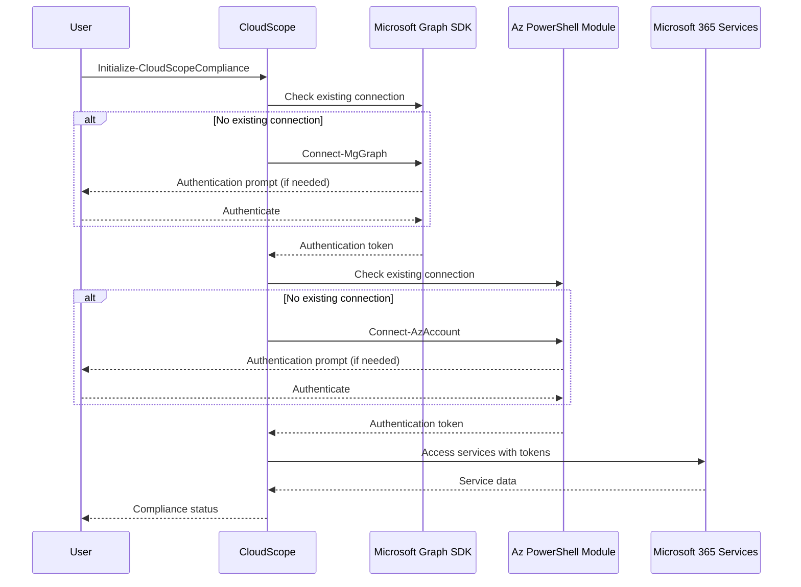

# Design Document: PowerShell Cloud Integration

## Overview

This design document outlines the architecture and implementation details for enhancing CloudScope's PowerShell modules to eliminate Docker dependencies, simplify setup, leverage existing Microsoft authentication, and ensure compatibility with LLM integration. The goal is to create a streamlined experience for Microsoft cloud administrators while maintaining comprehensive compliance monitoring capabilities. Additionally, the design incorporates FinOps capabilities for cost optimization and native visualization tools for compliance data analysis without third-party dependencies.

## Architecture

### High-Level Architecture

The enhanced PowerShell implementation will follow a modular architecture with the following components:

1. **Core Module** (`CloudScope.Core`): Contains shared functionality, authentication helpers, and common utilities
2. **Compliance Module** (`CloudScope.Compliance`): Implements compliance frameworks and validation logic
3. **Graph Module** (`CloudScope.Graph`): Handles Microsoft Graph API interactions for user, group, and data access
4. **Monitoring Module** (`CloudScope.Monitoring`): Provides real-time monitoring capabilities
5. **Reports Module** (`CloudScope.Reports`): Generates compliance reports and exports data in LLM-compatible formats

This modular approach allows users to install only the components they need while maintaining a cohesive experience.

### Authentication Flow



### Dependency Management

The solution will use PowerShell's built-in module management capabilities to handle dependencies:

1. Required modules will be installed from PowerShell Gallery using `Install-Module`
2. Version requirements will be specified in module manifests
3. Module auto-loading will be implemented for a seamless experience

## Components and Interfaces

### Core Module

The Core module will provide:

- Authentication helpers for Microsoft Graph and Azure
- Configuration management
- Logging and telemetry
- Error handling and reporting
- Common utilities for compliance operations

Key interfaces:

```powershell
# Authentication
Connect-CloudScopeServices [-TenantId <string>] [-Interactive] [-DeviceCode] [-ManagedIdentity]

# Configuration
Get-CloudScopeConfig
Set-CloudScopeConfig -Setting <string> -Value <object>
Import-CloudScopeConfig -Path <string>
Export-CloudScopeConfig -Path <string>

# Logging
Write-CloudScopeLog -Message <string> -Level <LogLevel> [-Tags <string[]>]
```

### Compliance Module

The Compliance module will implement:

- Framework-specific compliance rules (GDPR, HIPAA, PCI DSS, SOC2)
- Data classification and protection
- Compliance assessment and validation
- Remediation recommendations

Key interfaces:

```powershell
# Initialization
Initialize-CloudScopeCompliance [-Framework <ComplianceFramework>] [-EnableMonitoring]

# Assessment
Invoke-ComplianceAssessment -Framework <ComplianceFramework> [-Scope <string>] [-GenerateReport]

# Data Classification
Set-DataClassification -Path <string> -Classification <DataClassification> [-Framework <ComplianceFramework>]

# Access Control
Test-AccessControl -User <string> -Resource <string> -Permission <string> [-Framework <ComplianceFramework>]
```

### Graph Module

The Graph module will provide:

- Microsoft Graph API integration
- User and group management
- Data governance and protection
- Security and compliance alerts

Key interfaces:

```powershell
# Connection
Connect-CloudScopeGraph [-TenantId <string>] [-Scopes <string[]>] [-UseDeviceCode]

# User Management
Get-ComplianceUsers [-Filter <string>] [-IncludeRiskState] [-IncludeGuests] [-Top <int>]

# Data Discovery
Get-SensitiveDataLocations -DataType <string> [-Scope <string>]

# Alerts
Get-ComplianceAlerts [-Severity <string>] [-Status <string>] [-Days <int>]
```

### Monitoring Module

The Monitoring module will implement:

- Real-time compliance monitoring
- Alert configuration and management
- Metrics collection and analysis
- Integration with Azure Monitor

Key interfaces:

```powershell
# Monitoring
Start-ComplianceMonitoring [-WorkspaceName <string>] [-ResourceGroup <string>] [-CreateIfNotExists]
Start-RealtimeMonitoring -IntervalSeconds <int> [-EnableAlerts]
Stop-RealtimeMonitoring

# Alerts
Set-AlertingRules -RuleName <string> -Threshold <double> -Operator <string> -Severity <string>
```

### Reports Module

The Reports module will provide:

- Compliance report generation
- Data export in various formats
- LLM-compatible output formatting
- Scheduled reporting

Key interfaces:

```powershell
# Reports
New-ComplianceReport -ReportName <string> -Framework <ComplianceFramework> [-Format <string>]
New-ExecutiveSummary -Title <string> -Period <string> [-OpenAfterCreation]
New-FrameworkReport -Framework <ComplianceFramework> [-IncludeEvidence] [-IncludeRemediation]

# LLM Integration
Export-ComplianceDataForLLM -Assessment <object> -Path <string> [-Format <string>]
```

## Data Models

### Compliance Framework

```powershell
enum ComplianceFramework {
    GDPR
    PCI_DSS
    HIPAA
    SOC2
    ISO27001
    NIST
}
```

### Data Classification

```powershell
enum DataClassification {
    Public
    Internal
    Confidential
    Personal
    Health
    Financial
    Payment
}
```

### Compliance Assessment

```powershell
class ComplianceAssessment {
    [string]$Framework
    [datetime]$StartTime
    [datetime]$EndTime
    [timespan]$Duration
    [string]$Scope
    [ComplianceCheck[]]$Results
    [double]$ComplianceScore
    [int]$TotalChecks
    [int]$PassedChecks
    [int]$FailedChecks
    [ComplianceCheck[]]$Findings
}

class ComplianceCheck {
    [string]$Id
    [string]$Check
    [string]$Status  # Pass, Fail, Warning, NotApplicable
    [string]$Description
    [string]$Recommendation
    [string]$Framework
    [string]$Category
    [string]$Severity  # Low, Medium, High, Critical
    [object]$Evidence
}
```

### Compliance Violation

```powershell
class ComplianceViolation {
    [string]$Id
    [datetime]$Timestamp
    [string]$Type
    [string]$Description
    [string]$Severity  # Info, Warning, Error, Critical
    [string]$User
    [string]$Framework
    [object]$Details
}
```

## Error Handling

The solution will implement a comprehensive error handling strategy:

1. **Graceful Degradation**: If a component fails, other components will continue to function
2. **Detailed Error Messages**: Clear error messages with remediation steps
3. **Error Logging**: All errors will be logged for troubleshooting
4. **Retry Logic**: Automatic retry for transient errors with exponential backoff
5. **Validation**: Input validation to prevent errors before they occur

## LLM Integration

To ensure compatibility with LLMs, the solution will:

1. **Structure Data**: Use consistent, well-structured JSON formats for all outputs
2. **Include Context**: Provide sufficient context with each finding for LLM analysis
3. **Standardize Terminology**: Use consistent terminology across all outputs
4. **Machine-Readable Formats**: Export data in formats that LLMs can easily parse
5. **Semantic Tagging**: Include semantic tags to help LLMs understand the meaning of data

Example LLM-compatible output:

```json
{
  "complianceAssessment": {
    "framework": "GDPR",
    "score": 85.5,
    "timestamp": "2025-07-20T14:30:00Z",
    "findings": [
      {
        "id": "GDPR-DSR-001",
        "title": "Data Subject Request Process",
        "status": "Fail",
        "description": "No formal process for handling data subject requests was found",
        "severity": "High",
        "context": {
          "requirement": "Article 15 - Right of access by the data subject",
          "impact": "Organization may fail to respond to data subject requests within required timeframe",
          "affectedSystems": ["SharePoint", "Exchange"]
        },
        "remediation": {
          "steps": [
            "Create a formal DSR process document",
            "Implement DSR tracking system",
            "Train staff on handling DSRs"
          ],
          "automationPossible": true,
          "estimatedEffort": "Medium"
        }
      }
    ]
  }
}
```

## Testing Strategy

Following TDD (Test-Driven Development) principles, the testing strategy will focus on writing tests before implementation to ensure robust code and prevent issues before they occur:

### Test-Driven Development Approach

- Write failing tests first that clearly define expected behavior
- Implement minimal code to make tests pass
- Refactor while maintaining passing tests
- Use tests as documentation for module functionality

### Pre-flight Checks

Implement automated pre-flight checks that run before any development or deployment:

```powershell
# Pre-flight check example
function Test-CloudScopeEnvironment {
    [CmdletBinding()]
    param()
    
    $issues = 0
    
    # Check PowerShell version
    $requiredVersion = [version]'7.0.0'
    $currentVersion = $PSVersionTable.PSVersion
    if ($currentVersion -lt $requiredVersion) {
        Write-Error "PowerShell $requiredVersion or higher required. Current: $currentVersion"
        $issues++
    } else {
        Write-Host "✓ PowerShell version: $currentVersion" -ForegroundColor Green
    }
    
    # Check required modules
    $requiredModules = @('Microsoft.Graph', 'Az.Accounts')
    foreach ($module in $requiredModules) {
        if (-not (Get-Module -ListAvailable -Name $module)) {
            Write-Error "Required module not found: $module"
            $issues++
        } else {
            Write-Host "✓ Module available: $module" -ForegroundColor Green
        }
    }
    
    # Check configuration
    if (-not (Test-Path -Path "~/.cloudscope")) {
        Write-Warning "Configuration directory not found"
    }
    
    return $issues -eq 0
}
```

### Unit Testing

- Each module will have comprehensive unit tests using Pester
- Tests will be written before implementation (TDD approach)
- Mock external dependencies to ensure tests run without actual Microsoft services
- Test all public functions with various input scenarios
- Validate error handling and edge cases
- Include defensive coding patterns in tests

### Integration Testing

- Test interactions between modules
- Verify authentication flows with actual Microsoft services
- Validate data retrieval and processing
- Test compliance assessment against known configurations
- Implement circuit breaker patterns for external service calls

### Automated Validation

- Create automated validation scripts that can detect common issues
- Implement JSON schema validation for configuration files
- Add automatic fixes for common problems
- Include validation in CI/CD pipeline

### Defensive Coding Patterns

Implement defensive coding patterns throughout the codebase:

```powershell
# Example of defensive JSON loading
function Get-ConfigurationSafely {
    [CmdletBinding()]
    param(
        [Parameter(Mandatory = $true)]
        [string]$Path
    )
    
    try {
        # Check file exists
        if (-not (Test-Path -Path $Path)) {
            throw "Configuration file not found: $Path"
        }
        
        # Read content
        $content = Get-Content -Path $Path -Raw
        
        # Check not empty
        if ([string]::IsNullOrWhiteSpace($content)) {
            throw "Configuration file is empty: $Path"
        }
        
        # Parse JSON
        try {
            $config = $content | ConvertFrom-Json
        } catch {
            # Attempt to fix common JSON issues
            $fixed = $content -replace '//.*$', '' -replace '/\*[\s\S]*?\*/', '' -replace ',(\s*[\}\]])', '$1'
            $config = $fixed | ConvertFrom-Json
        }
        
        return @{
            Success = $true
            Config = $config
        }
    } catch {
        return @{
            Success = $false
            Error = $_.Exception.Message
            Path = $Path
            Recovery = "Check file format and permissions"
        }
    }
}
```

## Security Considerations

The solution will implement the following security measures:

1. **Secure Authentication**: Use modern authentication methods with MFA support
2. **Minimal Permissions**: Request only the permissions needed for each operation
3. **Secure Storage**: Store sensitive data in secure locations (KeyVault when available)
4. **Audit Logging**: Log all compliance-related operations for audit purposes
5. **Data Protection**: Implement data protection for sensitive compliance findings
6. **Secure Communications**: Use encrypted communications for all service interactions##
 FinOps Integration

To support cost optimization while maintaining compliance, the solution will implement:

### Cost Analysis Module

A new module (`CloudScope.FinOps`) will provide:

- Resource utilization analysis
- Cost optimization recommendations
- Compliance-aware cost management
- Budget impact assessment for remediation actions

Key interfaces:

```powershell
# Cost Analysis
Get-ComplianceCostImpact -Framework <ComplianceFramework> [-ResourceGroup <string>]
Get-OptimizationRecommendations [-IncludeComplianceImpact] [-ResourceGroup <string>]

# Budget Management
New-ComplianceBudget -Framework <ComplianceFramework> -Amount <decimal> [-Period <string>]
Get-ComplianceCostForecast -Framework <ComplianceFramework> [-Months <int>]

# Resource Optimization
Invoke-ResourceOptimization [-WhatIf] [-ComplianceCheck] [-ResourceGroup <string>]
```

### Cost-Compliance Balance

The solution will implement a scoring system that balances compliance requirements with cost optimization:

1. **Compliance Priority Score**: Measures the importance of a compliance control
2. **Cost Impact Score**: Measures the cost impact of implementing a control
3. **Optimization Score**: Combines both scores to prioritize high-value, low-cost controls

This approach ensures that organizations can achieve maximum compliance within budget constraints.

### Cost Tagging Strategy

The solution will implement a tagging strategy for cloud resources:

1. **Compliance Tags**: Identify resources required for compliance
2. **Framework Tags**: Associate resources with specific compliance frameworks
3. **Criticality Tags**: Indicate the compliance criticality of resources
4. **Optimization Tags**: Identify resources with optimization opportunities

These tags will be used for both compliance assessment and cost optimization.

## Visualization Capabilities

To provide rich visual analysis without third-party dependencies, the solution will implement:

### Native PowerShell Visualization

The solution will leverage PowerShell's capabilities for visualization:

1. **Console-Based Charts**: Using Unicode characters for simple charts
2. **HTML-Based Visualizations**: Using HTML/CSS/JavaScript for rich interactive visualizations
3. **SVG Generation**: Creating vector graphics for reports
4. **Terminal-Based UI**: Using terminal capabilities for interactive dashboards

Key interfaces:

```powershell
# Visualization
New-ComplianceVisualization -Data <object> -Type <VisualizationType> [-Path <string>]
New-ComplianceDashboard [-Framework <ComplianceFramework>] [-Interactive] [-Path <string>]
Convert-ComplianceDataToVisual -InputObject <object> -OutputFormat <string> [-Path <string>]
```

### Interactive Mindmaps

The solution will implement interactive mindmaps for exploring compliance relationships:

1. **HTML-Based Mindmaps**: Using JavaScript libraries embedded in HTML
2. **Clickable Nodes**: Interactive exploration of compliance findings
3. **Expandable/Collapsible**: Focus on specific areas of interest
4. **Export Capabilities**: Save as HTML, SVG, or PNG

Example mindmap structure:

```
Compliance Framework (GDPR)
├── Data Protection (85%)
│   ├── Encryption (100%)
│   ├── Access Controls (90%)
│   └── Data Minimization (65%)
├── Data Subject Rights (70%)
│   ├── Right to Access (100%)
│   ├── Right to Erasure (50%)
│   └── Right to Portability (60%)
└── Organizational Measures (80%)
    ├── Policies (90%)
    ├── Training (70%)
    └── Incident Response (80%)
```

### CSV and JSON Visualization

The solution will provide built-in visualization for CSV and JSON files:

1. **Auto-Detection**: Automatically detect data structure
2. **Smart Visualization**: Choose appropriate visualization based on data
3. **Interactive Filtering**: Filter and sort data in visualizations
4. **Drill-Down**: Explore hierarchical data

Key interfaces:

```powershell
# Data Visualization
Show-CSVVisualization -Path <string> [-VisualizationType <string>] [-Interactive]
Show-JSONVisualization -Path <string> [-VisualizationType <string>] [-Interactive]
ConvertTo-InteractiveReport -Path <string> [-OutputPath <string>]
```

### Cross-Platform Compatibility

All visualizations will be designed to work across platforms:

1. **Windows**: Full support for all visualization types
2. **macOS**: Terminal and HTML-based visualizations
3. **Linux**: Terminal and HTML-based visualizations

The solution will detect the platform and adapt visualizations accordingly.